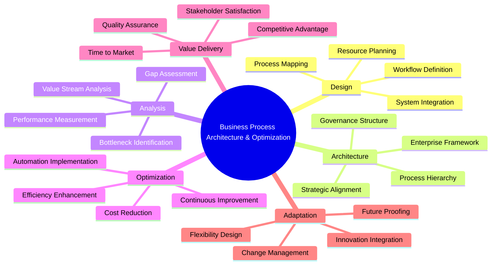
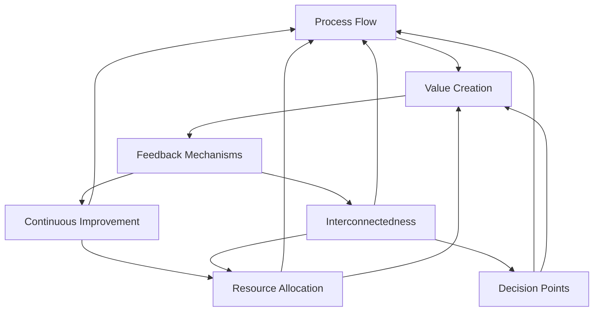
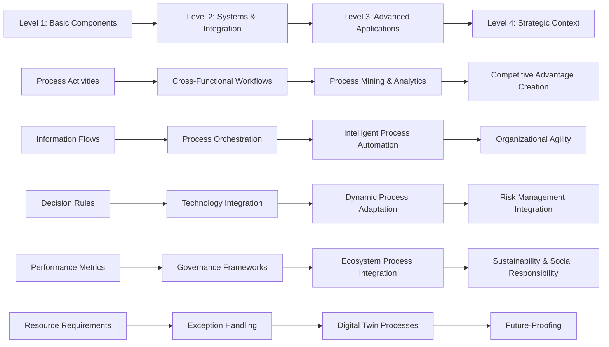
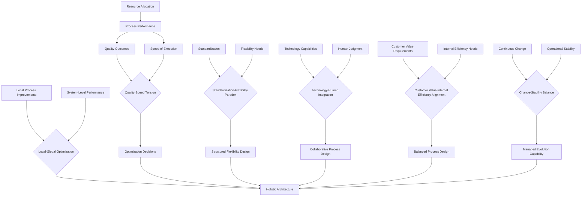

# Analysis: Business Process Architecture and Optimization

## Definition

Business Process Architecture and Optimization is the systematic discipline of designing, mapping, analyzing, and continuously improving the structured sequence of activities, decisions, and information flows that organizations use to deliver value to stakeholders. It encompasses both the strategic framework for organizing processes across the enterprise (architecture) and the methodical enhancement of these processes to maximize efficiency, effectiveness, and adaptability (optimization).

## Foundational Concepts

1. **Process Flow** - The sequential movement of work, information, and decisions through defined stages to produce outcomes
2. **Value Creation** - The transformation of inputs into outputs that meet stakeholder needs and organizational objectives
3. **Resource Allocation** - The distribution and utilization of human, technological, and financial assets within process execution
4. **Decision Points** - Critical junctures where choices determine process direction, outcomes, and resource consumption
5. **Feedback Mechanisms** - Systems that capture performance data and stakeholder input to enable process learning and adaptation
6. **Interconnectedness** - The web of dependencies and relationships between processes across organizational boundaries
7. **Continuous Improvement** - The ongoing cycle of measurement, analysis, and refinement to enhance process performance

## Hierarchical Levels

### Level 1: Basic Components

**Process Activities**: Individual tasks and operations that transform inputs into outputs. Example: A customer service representative receiving a complaint call, documenting the issue, and routing it to the appropriate department.

**Information Flows**: Data and knowledge movement between process steps. Example: Customer information flowing from sales to fulfillment to billing systems.

**Decision Rules**: Criteria and logic governing process choices. Example: Credit approval thresholds determining loan application routing to automated systems versus manual review.

**Performance Metrics**: Quantitative measures of process effectiveness. Example: Order processing time, error rates, customer satisfaction scores.

**Resource Requirements**: Human skills, technology, and physical assets needed for process execution. Example: Trained staff, software systems, warehouse space for an order fulfillment process.

### Level 2: Systems & Integration

**Cross-Functional Workflows**: Processes spanning multiple departments or business units. Example: New product development involving R&D, marketing, manufacturing, and sales coordination.

**Process Orchestration**: The coordination and sequencing of multiple sub-processes. Example: Supply chain management orchestrating procurement, production planning, inventory management, and distribution.

**Technology Integration**: Systems and platforms enabling process automation and connectivity. Example: ERP systems integrating financial, operational, and customer data across business functions.

**Governance Frameworks**: Structures ensuring process compliance, quality, and alignment with organizational standards. Example: Quality management systems with defined approval gates and audit procedures.

**Exception Handling**: Mechanisms for managing process deviations and unexpected scenarios. Example: Escalation procedures when customer complaints exceed resolution timeframes.

### Level 3: Advanced Applications

**Process Mining and Analytics**: Advanced data analysis techniques revealing process patterns and optimization opportunities. Example: Using transaction logs to identify bottlenecks in mortgage application processing.

**Intelligent Process Automation**: AI and machine learning enhancing process capabilities. Example: Chatbots handling routine customer inquiries while learning from interactions to improve responses.

**Dynamic Process Adaptation**: Real-time process modification based on changing conditions. Example: E-commerce websites adjusting checkout processes based on traffic patterns and conversion data.

**Ecosystem Process Integration**: Extending processes beyond organizational boundaries to include partners, suppliers, and customers. Example: Just-in-time manufacturing coordinating with supplier production schedules and customer demand forecasts.

**Digital Twin Processes**: Virtual replicas enabling process simulation and optimization. Example: Simulating different staffing scenarios in call centers to optimize service levels and costs.

### Level 4: Strategic Context

**Competitive Advantage Creation**: Processes as sources of differentiation and market positioning. Example: Amazon's logistics processes enabling same-day delivery capabilities that competitors cannot match.

**Organizational Agility**: Process flexibility enabling rapid response to market changes. Example: Software development companies using agile methodologies to quickly adapt products to customer feedback.

**Risk Management Integration**: Embedding risk assessment and mitigation into core processes. Example: Financial services integrating fraud detection algorithms into payment processing workflows.

**Sustainability and Social Responsibility**: Processes supporting environmental and social objectives. Example: Circular economy processes that minimize waste and maximize resource reuse.

**Future-Proofing**: Designing processes to accommodate technological advancement and changing business models. Example: Retail processes that seamlessly integrate online, mobile, and physical store experiences.

## Key Relationships

**Performance-Resource Dependency**: Process performance directly correlates with appropriate resource allocation. Insufficient resources create bottlenecks, while excess resources increase costs without proportional value creation.

**Quality-Speed Tension**: Faster processes often require quality trade-offs unless supported by improved methods or technology. Optimization must balance these competing demands based on stakeholder priorities.

**Standardization-Flexibility Paradox**: Standardized processes improve efficiency and predictability but may reduce adaptability to unique situations. Architecture must provide structured flexibility through exception handling and variation management.

**Technology-Human Integration**: Process optimization increasingly depends on effective collaboration between automated systems and human judgment. Success requires designing complementary roles rather than simple substitution.

**Local-Global Optimization**: Improving individual process steps may create sub-optimization at the system level. Architecture requires holistic perspective ensuring local improvements contribute to overall organizational performance.

**Customer Value-Internal Efficiency Alignment**: Processes must simultaneously deliver external customer value and internal operational efficiency. Misalignment leads to either unsustainable costs or inadequate value delivery.

**Change-Stability Balance**: Continuous improvement requires ongoing process change while maintaining operational stability. Organizations must develop capabilities for managed evolution without disrupting core operations.

