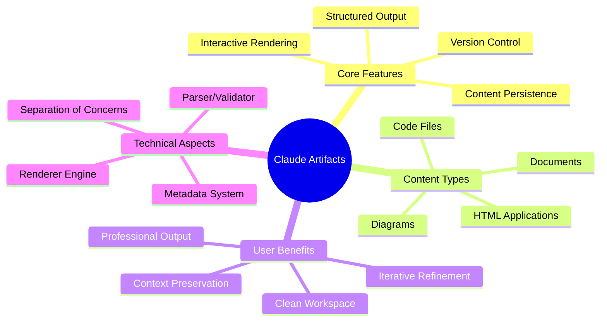
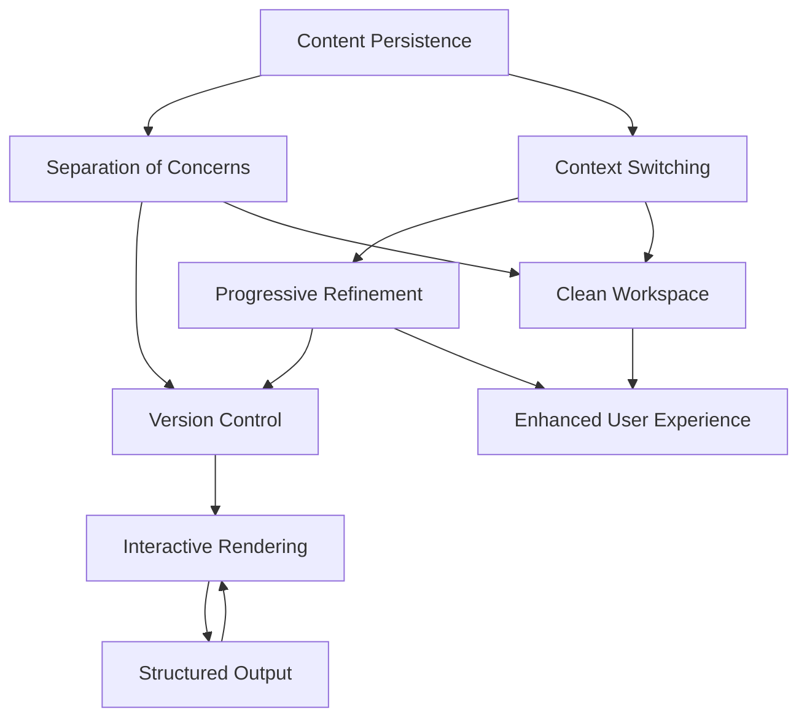
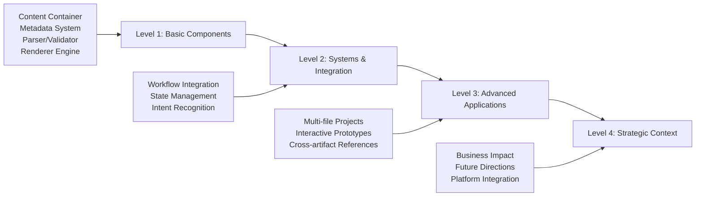
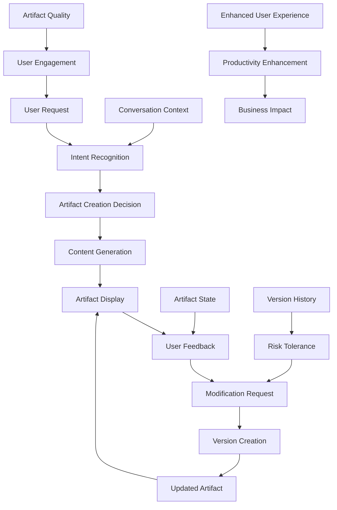

# Artifact Feature in Claude

## Definition
Claude's Artifact feature is a specialized content generation system that creates, displays, and manages structured outputs (code, documents, diagrams, interactive content) in a dedicated, persistent viewing panel separate from the conversation flow. It enables iterative refinement of complex content while maintaining version history and providing a clean workspace for substantial deliverables.

## Foundational Concepts

1. **Content Persistence** - Artifacts maintain state across conversation turns
2. **Separation of Concerns** - Conversation vs. deliverable content are handled distinctly
3. **Version Control** - Each modification creates a new version while preserving history
4. **Interactive Rendering** - Content is executed/displayed in appropriate viewers
5. **Structured Output** - Content follows specific formats (HTML, SVG, Markdown, code)
6. **Context Switching** - Users can reference and modify artifacts without losing conversation flow
7. **Progressive Refinement** - Iterative improvement through conversational feedback

## Hierarchical Levels

### Level 1: Basic Components

**Core Elements:**
- **Content Container**: Isolated rendering environment for artifact content
- **Metadata System**: Tracks artifact type, title, version, and creation context
- **Parser/Validator**: Ensures content meets format requirements and safety standards
- **Renderer Engine**: Displays content appropriately (code highlighting, HTML execution, etc.)

**Basic Operations:**
- Create new artifact from conversation request
- Update existing artifact with modifications
- Display artifact alongside conversation
- Switch between artifact versions

### Level 2: Systems & Integration

**Workflow Integration:**
The artifact system integrates with Claude's natural language processing to detect when substantial content should be artifacted rather than displayed inline. This involves:
- **Intent Recognition**: Identifying requests for substantial, structured content
- **Content Classification**: Determining appropriate artifact type (code, document, diagram)
- **Handoff Mechanism**: Seamlessly transitioning from conversation to artifact creation

**State Management:**
- **Session Persistence**: Artifacts remain available throughout the conversation
- **Reference System**: Ability to refer back to specific artifact versions
- **Context Linking**: Maintaining connection between conversation context and artifact content

### Level 3: Advanced Applications

**Complex Use Cases:**
- **Multi-file Projects**: Creating interconnected code files or documentation suites
- **Interactive Prototypes**: HTML/JavaScript applications with user interaction
- **Data Visualization**: SVG charts and diagrams that respond to data changes
- **Collaborative Iteration**: Rapid prototyping through conversational refinement

**Advanced Features:**
- **Cross-artifact References**: Linking multiple artifacts within a project
- **Template Systems**: Reusable patterns for common artifact types
- **Export Capabilities**: Extracting artifacts for external use
- **Integration Hooks**: Connecting with external development environments

### Level 4: Strategic Context

**Business Impact:**
- **Productivity Enhancement**: Reduces friction in content creation workflows
- **Quality Improvement**: Enables iterative refinement without losing previous versions
- **Accessibility**: Makes complex content creation available to non-technical users
- **Educational Value**: Demonstrates concepts through interactive examples

**Future Directions:**
- **Real-time Collaboration**: Multiple users working on shared artifacts
- **Advanced Rendering**: 3D visualizations, video content, complex simulations
- **AI-Assisted Debugging**: Automatic error detection and correction in artifacts
- **Platform Integration**: Direct deployment to hosting services or development platforms

## Key Relationships

**Primary Dependencies:**
1. **Conversation Context → Artifact Creation**: User requests drive artifact generation
2. **Artifact State → Conversation Flow**: Current artifact version influences subsequent modifications
3. **User Feedback → Iterative Improvement**: Conversational input drives version evolution

**Cause-Effect Relationships:**
- **Substantial Content Request** → **Artifact Creation Decision**: Complex deliverables trigger artifacting
- **Modification Request** → **Version Creation**: Changes create new versions while preserving history
- **Artifact Complexity** → **Enhanced User Experience**: Rich content provides better understanding and usability

**Feedback Loops:**
- **User Interaction** ↔ **Content Refinement**: Users see results, request changes, leading to improved artifacts
- **Artifact Quality** ↔ **User Engagement**: Better artifacts encourage more sophisticated use cases
- **Version History** ↔ **Risk Tolerance**: Ability to revert changes encourages experimentation

**Critical Success Factors:**
The effectiveness of the artifact system depends on the seamless integration of content generation intelligence, rendering capabilities, and conversational context preservation, creating a unified experience that enhances rather than interrupts the natural flow of human-AI collaboration.

